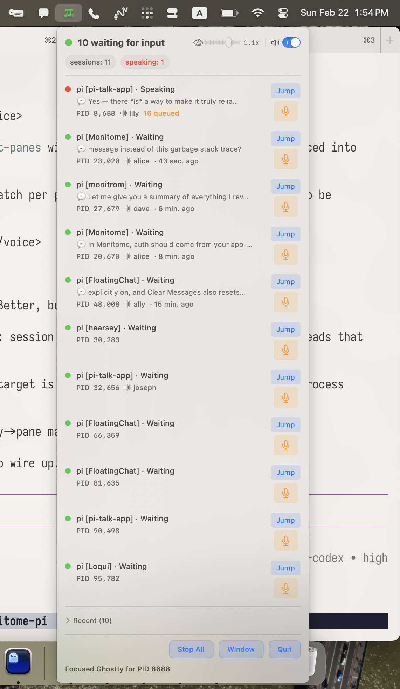
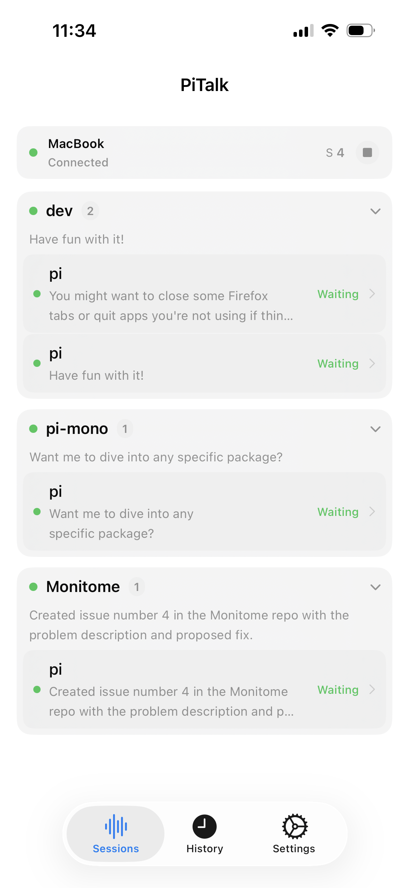

#  Managerie

Managerie is a macOS menu bar app that keeps your menagerie of coding agents in one place — Pi, Codex, Claude Code, or any other local agent.

Agents send messages to Managerie's local broker; Managerie surfaces them as macOS notifications, tracks live agent status in the menu bar, lets you **jump** straight to any agent's terminal session, and lets you **dictate** replies (speech → text) into a session.

| Managerie macOS menu bar app | Managerie iOS companion app |
|---|---|
|  |  |

For the iPhone companion app docs, see:

- `apps/managerie-ios/README.md`
- `apps/managerie-ios/SETUP.md`

## Install with Homebrew

```bash
brew tap swairshah/tap
brew install --cask swairshah/tap/managerie
```

Then launch Managerie from Applications (or via Spotlight) and start sending broker requests.

### Pi extensions

To use Managerie with Pi, install the managerie and [`pi-telemetry`](https://github.com/jademind/pi-telemetry) extensions:

```bash
pi install npm:@swairshah/managerie
pi install npm:@jademind/pi-telemetry
```

## What this app does

- Runs a local agent broker on `127.0.0.1:18091` (NDJSON over TCP)
- Accepts `speak` (message), `status`, `health`, and `stop` commands from any local client
- **Notification-first**: agent messages appear in Notification Center — click one to jump to that agent's terminal session
- Shows live agent status in the menu bar (thinking / editing / running / waiting …)
- **Jump**: focuses the right terminal window/pane for a session (Ghostty, iTerm2, Terminal, tmux, zellij)
- **Dictate**: record audio, transcribe on-device (Apple Speech), and send it into an agent session
- Keeps request history (queued / notified / played / interrupted / failed)
- Optional remote WebSocket control API for iOS/phone clients (`ws://<host>:18092/ws`)

## Use it as an agent hub (from any app)

Example broker call:

```bash
echo '{"type":"speak","text":"Hello from another app","sourceApp":"my-app","sessionId":"abc-123"}' | nc 127.0.0.1 18091
```

Health check:

```bash
echo '{"type":"health"}' | nc 127.0.0.1 18091
```

## Remote control API (WebSocket)

Managerie also includes a WebSocket remote API intended for an iPhone companion app.

Default endpoint:

```text
ws://127.0.0.1:18092/ws
```

Use these env vars for tailnet exposure:

```bash
MANAGERIE_REMOTE_BIND=0.0.0.0
MANAGERIE_REMOTE_PORT=18092
MANAGERIE_REMOTE_TOKEN=<strong-shared-token>
```

Dev-only no-token override:

```bash
MANAGERIE_REMOTE_BIND=0.0.0.0
MANAGERIE_REMOTE_PORT=18092
MANAGERIE_REMOTE_ALLOW_INSECURE_NO_AUTH=1
```

Protocol docs:

- `docs/REMOTE_WS_PROTOCOL.md`
- `docs/IOS_REMOTE_PLAN.md`

## Pi-specific pieces in this repo

- **`Extensions/managerie`** - forwards Pi messages, live status, and inbox replies to Managerie
- **`Sources/Managerie`** - menu bar app + broker + notification pipeline
- **`Sources/mnote`** - CLI client for sending notifications
- **`apps/managerie-ios`** - iPhone companion app scaffold (WebSocket client + session UI)

## Quick start (dev)

```bash
./run-dev.sh
```

## Build app bundle

```bash
./scripts/build-app.sh
open .build/Managerie.app
```

## Requirements

- macOS 13+
- Accessibility permission for jump-to-session; microphone permission for dictation
- Dictation uses Apple's on-device speech recognition — no API keys, no network

## Related projects

- [`pi-telemetry`](https://github.com/jademind/pi-telemetry) — structured runtime telemetry for Pi. Managerie reads telemetry heartbeats to show live agent state in the menu bar.
- [`pi-statusbar`](https://github.com/jademind/pi-statusbar) — a free macOS status bar app for Pi built on top of `pi-telemetry`. The menu bar status UX in Managerie was directly inspired by this project.

## Acknowledgements

- The menu bar status UX was inspired by [`pi-statusbar`](https://github.com/jademind/pi-statusbar).
- In our Pi workflow, we use both the [`pi-statusbar` extension](https://github.com/jademind/pi-statusbar) and this repo's **managerie extension** together.
